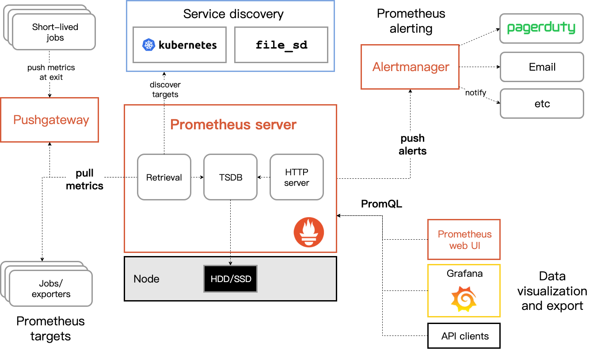

# Prometheus 概览
1. 配置,目标配置/动态目标配置(服务发现)
2. 规则配置，Recording规则，Alert规则
3. 查询，PromQL使用，Grafana
4. 存储,prometheus的存储：本地，集成远程存储
5. 联邦，prometheus集群
6. 管理API,健康检查、准备就绪检查、触发重新加载、关闭

# 什么是 Prometheus?
Prometheus是一款开源的系统监控和告警工具包，最初由`SoundClound`开发。后成功CNCF第二个项目。

特性：
- 一个多维数据模型，其中包含指标名称和k-v标签的时序数据
- PromQL是一种灵活的查询语言，可利用维度
- 不依赖分布式存储：单个服务器节点可以自治
- 时间序列数据采集通过HTTP的`拉取模式`进行的
- 推送时间序列数据是通过中间网关实现的。
- 目标通过服务发现或静态配置来发现
- 支持多种图表和仪表盘模式

# 都有哪些组件?
Prometheus 生态由多个组件组成，其中许多组件是可选的:
- 主 Prometheus 服务器，用于抓取和存储时间序列数据
- 用于检测应用程序代码和客户端库
- 一个支持短期工作的推送网关
- 适用于HAProxy,StatsD,Graphite 等服务的专用 Exporter
- 各种工具支持

# 架构
指标收集方式:
- 客户端推送到`Pushgateway`，Server 向`Pushgateway`抓取指标
- Server 直接抓取目标指标

服务发现方式:
- etcd
- ..

可视化：
- Prometheus server web UI
- Grafana
- API Clients

